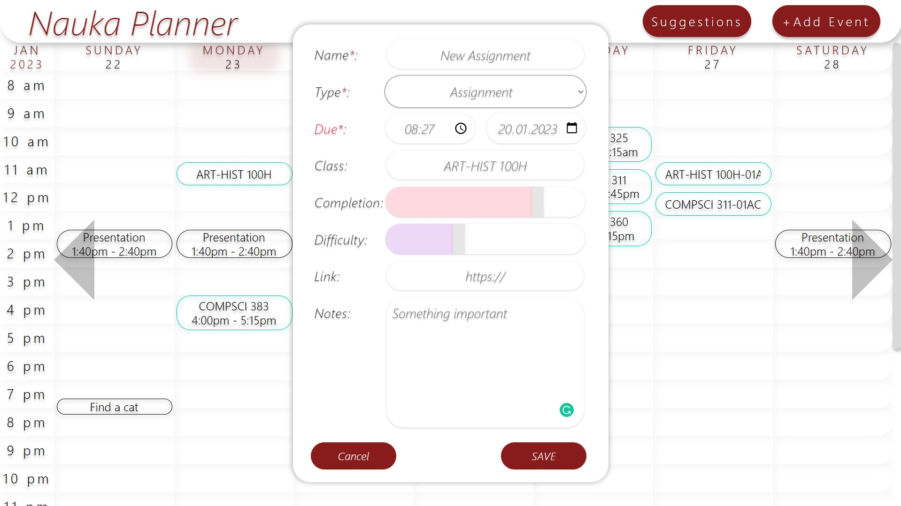
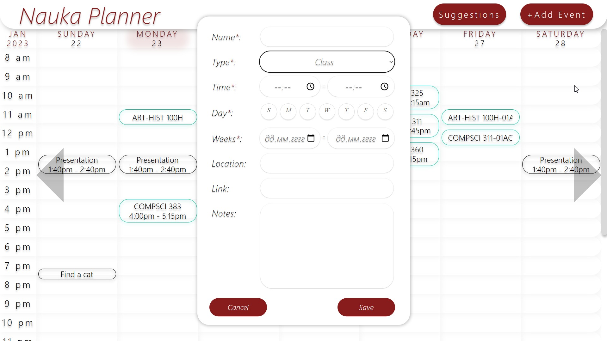
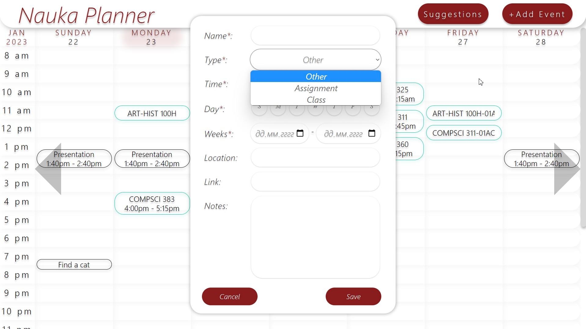
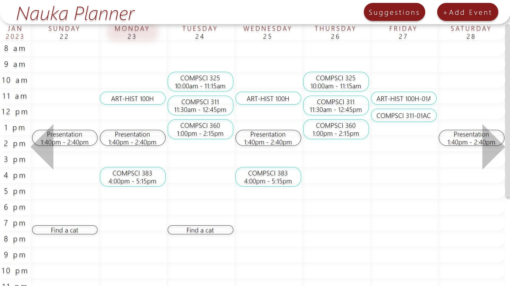

# NaukaPlanner (Unfinished Project)
NaukaPlanner is a calendar for students to get suggestions on scheduling their homework. It has a pleasant minimalistic UI.
 
# Render Link (Cloud Application Hosting) [NOT WORKING ANYMORE, REQUIRES AN UPDATE]: https://naukaplanner-webapp.onrender.com

# Screenshots:

